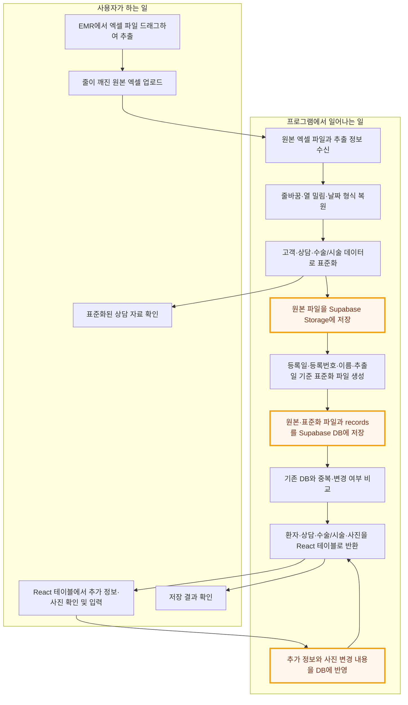
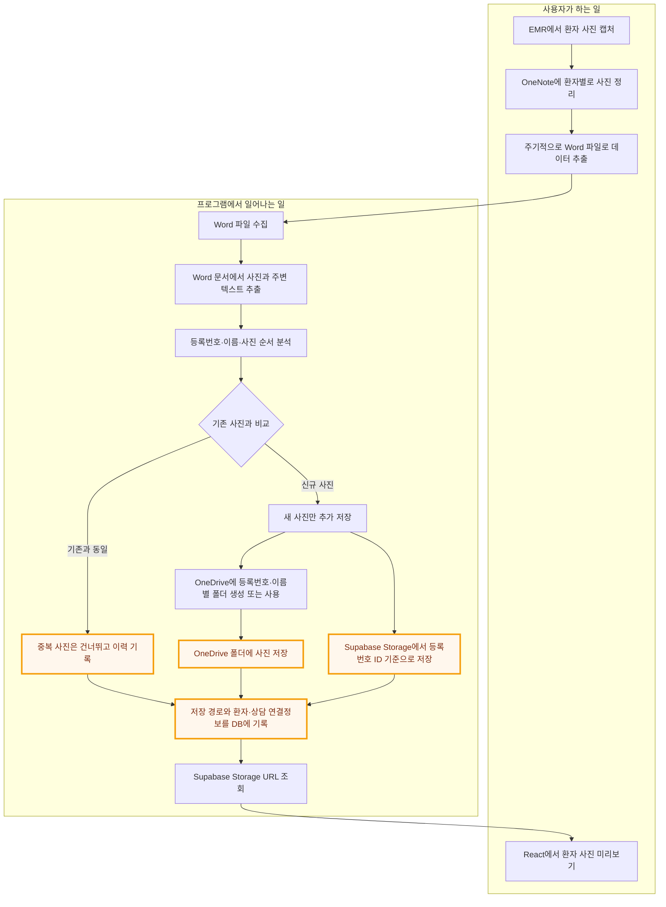
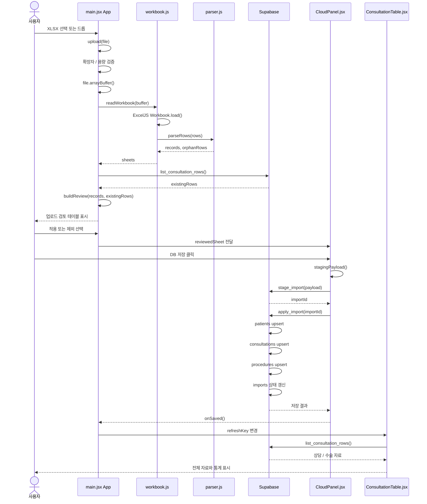

# 상담 데이터 흐름 문서

이 문서는 `z_consult`의 엑셀 업로드부터 Supabase 저장, 전체 자료 조회까지의 데이터 흐름을 정리한다.

## 1. 사용자 행동과 시스템 처리 분리형

EMR에서 추출한 원본 엑셀을 보존하면서 표준화하고, React 테이블에서 추가 정보를 입력한 뒤 다시 DB에 반영하는 업무 관점의 흐름이다.

## 2. 사진 자료 업무 흐름: 사용자 행동과 시스템 처리 분리형

EMR에서 캡처한 사진을 OneNote와 Word를 거쳐 OneDrive 및 Supabase Storage에 저장하고, React에서 미리보기하는 업무 흐름이다.

### 사진 저장 기준

- OneDrive에는 `등록번호_이름` 기준의 환자별 폴더를 만든다.
- 같은 환자의 기존 사진은 유지하고, 새로 확인된 사진만 추가한다.
- 중복 여부는 파일 해시, 원본 파일명, 촬영일, 이미지 메타데이터 등을 조합해 판단한다.
- Supabase Storage에는 환자 등록번호 또는 내부 환자 ID를 기준으로 경로를 만든다.
- DB에는 Storage 경로, 원본 출처, 업로드 시각, 환자·상담 연결정보를 보관한다.
- React는 DB에 저장된 Storage 경로를 기준으로 접근 URL을 발급받아 미리보기한다.

## 3. 컴포넌트와 함수 호출 중심의 시퀀스

React 컴포넌트와 주요 함수가 실제로 호출되는 순서를 표현한다.

## 파일별 책임

| 파일 | 역할 |
| --- | --- |
| `src/main.jsx` | 업로드, 시트 선택, 기존 DB 비교, 검토 상태 관리 |
| `src/lib/workbook.js` | ExcelJS로 XLSX를 읽고 시트 단위 결과 생성 |
| `src/lib/parser.js` | 원본 행을 고객·상담·수술/시술 레코드로 복원 |
| `src/lib/staging.js` | 파일 해시, 연결 오류, Supabase staging payload 처리 |
| `src/features/CloudPanel.jsx` | 로그인, 권한 확인, 임시 적재, 본 DB 반영 |
| `src/features/ConsultationTable.jsx` | DB 조회, 검색, 필터, 상담·수술 통계 표시 |
| `supabase/migrations/*` | 테이블, RLS, `stage_import`, `apply_import`, 조회 RPC 정의 |

## 흐름을 읽는 기준

- `workbook.js`와 `parser.js`까지는 브라우저 메모리에서 처리된다.
- 파일을 선택하는 것만으로는 Supabase에 전송하지 않는다.
- 기존 DB 비교는 `list_consultation_rows` RPC로 수행한다.
- 사용자가 제외한 레코드는 `reviewedSheet.records`에서 제거된 후 저장된다.
- `stage_import`는 업로드 원본과 이력을 임시 적재한다.
- `apply_import`는 검토된 레코드를 `patients`, `consultations`, `procedures`에 upsert한다.
- 저장이 끝나면 `ConsultationTable`이 최신 자료를 다시 조회한다.

## 구현 계획

### 1. 업로드 화면 확장

XLSX·DOCX 파일 업로드와 파일 형식 검증

### 2. 엑셀 데이터 처리

줄 깨짐 복원, 표준화, 기존 DB 비교, 상담·수술 데이터 추출

### 3. Word 사진·메모 추출

등록번호·이름·시점·사진·특이사항 분석 및 환자별 연결

### 4. 원본 파일 저장

정상 파일만 원본 Word·Excel 파일과 업로드 이력 저장

### 5. 사진 Storage 저장

사진 파일명 생성, 중복 검사, Supabase Storage 업로드, 사진 메타데이터 저장

### 6. 메인 테이블 확장

사진 미리보기, 사진 개수, 실장 메모, 의사 상담 메모, 의사 수술 메모 표시

### 7. 메모·사진 수정 기능

메인 테이블에서 메모 입력, 사진 추가·제외, DB 재저장

### 8. 업로드 원본 이력 관리

파일명, 추출 기간, 업로드 시각, 처리 상태, 환자 수, 사진 수, 오류 수 표시

### 9. Supabase 권한·저장 RPC 구성

업로드·사진·메모 저장 RPC와 사용자별 접근 권한 적용

### 10. 검증 및 오류 처리

잘못된 파일 차단, 미연결 사진·중복·파싱 오류 표시, 재처리 지원
